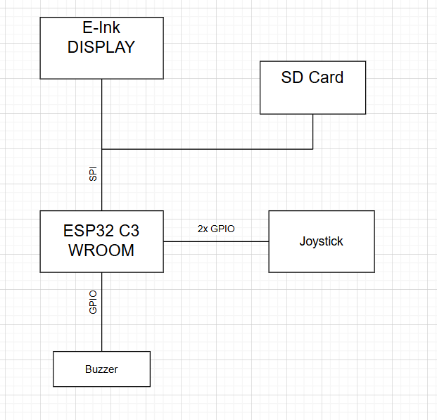
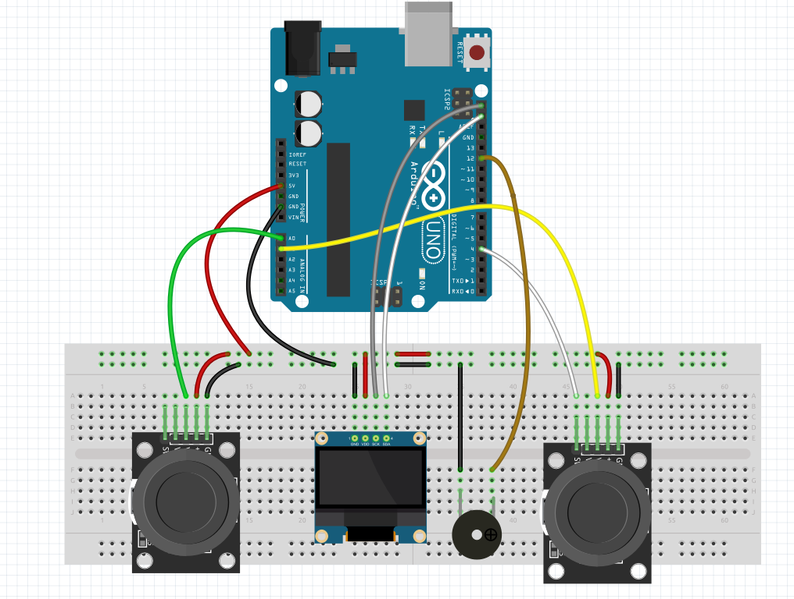

# Pong game

## Introduction
This project uses an Atmega328P microcontroller to implement a Pong game. The game has two joysticks to control the paddles of two players, a TFT screen for graphical control of the player and an audio buzzer. In addition, users can choose the difficulty of the game using an interactive menu. The project demonstrates the ability of Arduino to control multiple components simultaneously, putting into practice many fundamental concepts such as: the use of ADCs, SPI prototypes and interrupts.

## General Description
### Main features:

1. ```Game Difficulty Selection:```

The game starts with an interactive menu displayed on the TFT screen.
The user can navigate between options: Easy, Medium and Hard by moving the joystick along the Y-axis.
Confirmation of the selection is made by pressing the joystick button.

2. ``` Pong Game:```

The paddles are controlled by the position of two joysticks, with each player having complete control over the movement of their own paddle.
The ball moves automatically and its speed depends on the selected difficulty.

Collisions of the ball with the paddles and the edge of the screen are detected, changing the direction of the ball or awarding points.
Player scores are displayed in real time on the screen.

3. ``` Sound ```

The buzzer emits short signals for key events (collisions, menu, confirmations).


### Project Flow

1. ```Initialization:```
 Configure the pins, the SPI component for the TFT screen, and the ADC to read the joysticks.
 A welcome message is displayed on the screen, followed by the difficulty selection menu.

2. ```Difficulty menu:```
 Arduino checks the position of joystick to navigate between options (ADC reading).
 When the joystick is pressed, the interrupt associated with the button confirms the selection, and the game begins.
 The speed of the ball is adjusted according to the chosen difficulty.

3. ```Game loops:```

    Joysticks: Update the positions of the paddles based on the constant reading of the ADCs.

    Collisions: Detect the interaction of the ball with the paddles or the edges of the screen.
 
    Score: When the ball leaves the field, the point is awarded accordingly and the ball is reset.

## Schema bloc


### Technical details

1. ```ADC``` (Analog-to-Digital Conversion):
Used to read the joystick positions (Y-axis for each player).
The readings are used to move the paddles or navigate the difficulty menu.

2. ``` SPI``` (Serial Peripheral Interface):
Used for fast communication with the TFT screen.
The screen displays all information: menu, game, scores and system messages.

3. ``` Interrupts: ```
Pressing joystick 2 triggers an interrupt to confirm the selection in the menu.
This allows for fast responses to user actions.


# Hardware Design

##  Components


|   Component name       |     Source piece          | Datasheet                                                                                      | 
|------------------------|---------------------------|------------------------------------------------------------------------------------------------|
|   **1x Arduino**       | faculty                 | https://ww1.microchip.com/downloads/en/DeviceDoc/ATmega164P-324P-644P-Data-Sheet-40002071A.pdf |
|    1x LCD TFT          | I bought https://www.aliexpress.com/item/1005005978400236.html?src=google              | https://randomnerdtutorials.com/guide-to-1-8-tft-display-with-arduino/                         |
|    2x joystick         | faculty                 | https://components101.com/modules/joystick-module                                              |
|    1x buzzer           | faculty                 | https://www.farnell.com/datasheets/2171929.pdf                                                 |
|    1x breadboard       | faculty                 |                                                                                                |
     





| Component         | Arduino Uno Pin |
|-------------------|------------------|
| **1.8" TFT Display** |               |
| LED               | 3.3V             |
| SCK               | 13               |
| SDA               | 11               |
| A0/DC             | 9                |
| RESET             | 8                |
| CS                | 10               |
| GND               | GND              |
| VCC               | 5V               |
| **Buzzer**        | 7                |
| **Joystick 1 VRy** | A0              |
| **Joystick 2 Vry**  | A1             |
| **Joystick 2 Sw**  | 3               |

# Software Design


# Results Obtained
# Conclusions
